# r/ADHD Network Structures and Sentiment Analysis

### Table of Contents
- [Description](#description)
- [Data Sources](#data-sources)
- [Running the Code](#running-the-code)
- [Results](#results)

### Description
The aim of the project was to identify conversation trends, key users, and community perceptions in online support communities to understand community dynamics and varied perceptions of ADHD.

We queried the Reddit API to gather posts, comments, and user information data from the r/ADHD subreddit, which was created in 2008 and has over 1.7 million members. After cleaning up the data, we conducted network analysis and sentiment analysis on the resulting dataset.

The network analysis included visualizing a network map of the subreddit with NetworkX and Matplotlib, with metrics such as the number of nodes and edges, network density, and degree distribution to highlight distinct subgroups and identify leaders. We also identified key conversation topics and keywords with NLTK and spaCy, using NLP techniques such as topic modeling and word clouds.

With the gathered results, we hope to provide actionable insights and awareness into support structures within neurodevelopmental disorder communities to help foster a more supportive environment.

All data files can be found within the "datasets" directory.

### Data Sources
1. [Reddit API](https://www.reddit.com/dev/api/)
An API provded by Reddit that was used to collect data on the post submissions and comments on the r/ADHD for the time period of October 10, 2023 to November 11, 2023. This provided over a month of data to work with, which consisted of 3064 submissions and 43764 comments.

A sample of the submissions and comments that were scraped.
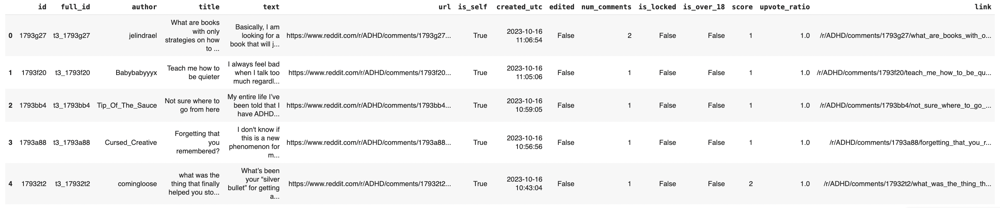
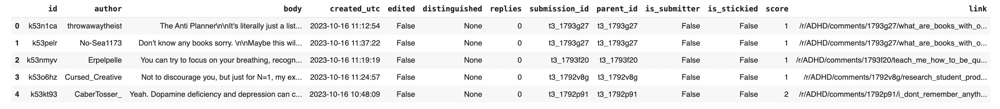

### Running the Code
There are four main notebook files.

1. **reddit_scrape.ipynb**:  
Gets the submissions and comments data scraped from Reddit API. The two datasets are saved to the datasets/ directory.

2. **reddit_network_analysis.ipynb**:  
A network analysis which includes visualizations of the network, with graphs such as a NetworkX visualization and degree distribution graphs.

3. **reddit_correlation_analysis.ipynb**:  
Subjectivity and polarity sentiment analysis of submissions and comments, with a Pearson's correlation analysis.

4. **reddit_scrape_merge.ipynb**:  
Creates the network dataset, which is saved to the datasets/ directory. Additionally, as we scraped the subreddit twice at different times with **reddit_scrape.ipynb** to get a good sample of data, there was a need to merge the two datasets collected at different times together into a comprehensive one.

### Results

Highly recommend looking at the [PDF](reddit-network.pdf).

**Network Analysis**
An undirected graph of the network with degree distribution, where the circles with labels being users that have a degree > 50 and the size of the circle is the scale of the degree. The user with the highest degree had a degree of 421.

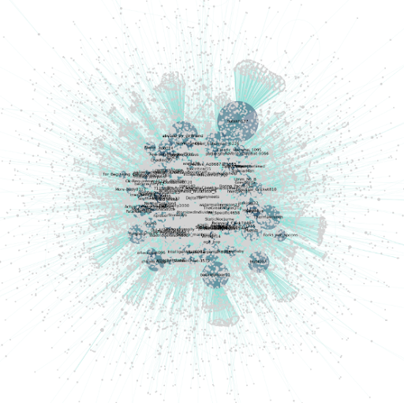
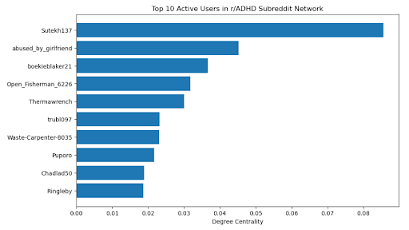

The degree distribution suggests that the majority of users are not connected to each other, but there are a few key leaders that interact frequently with many users.

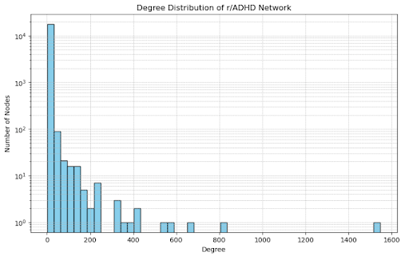
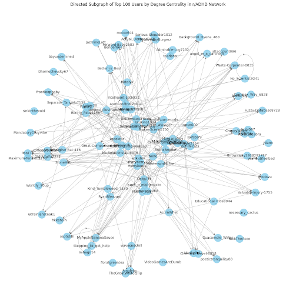

The network dataset is merged between the submissions and comments dataset to find users that are connected to one another.

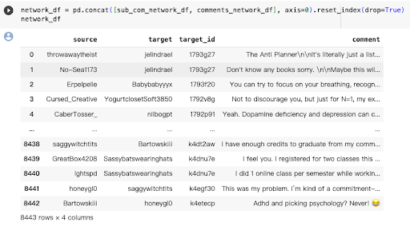

**Sentiment Analysis**
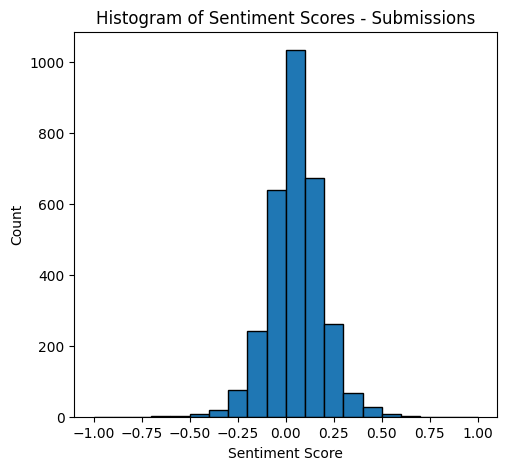
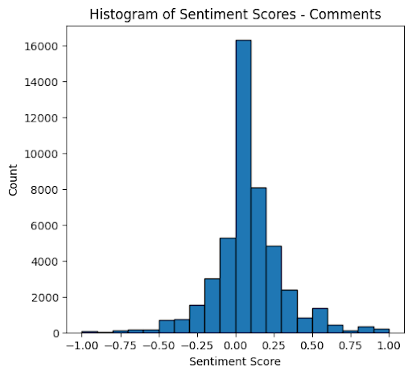

The effects of emotional contagion are demonstrated in the dataset, which suggests that emotion expressed by others influence our own emotions. The positive correlation suggests that when a submission is more positive, its comments tends to be more positive as well. However, the correlation is small (0.1), indicating a relatively weak, positive relationship. A one-sample t-test to see how much comments under the same submission deviated from the mean polarity suggested that users’ comments tend to share the same sentiments within a submission.

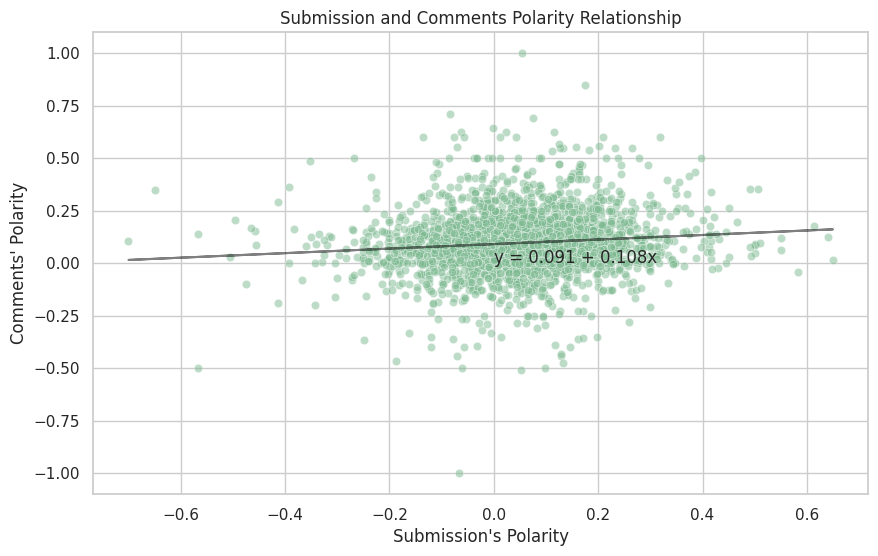
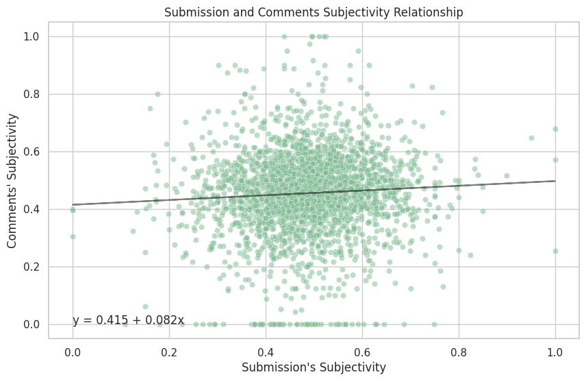

An analysis of mentions of medication within the subreddit suggest that there is room for improvement with medications.

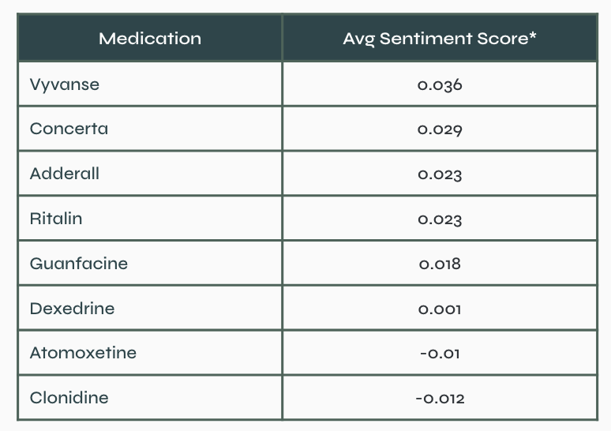
